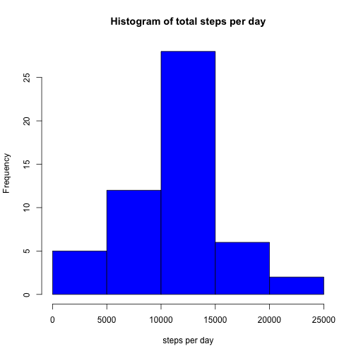

## Loading and preprocessing the data

####1. Load the data
In order to start the project we first need to load the data from the course web site by clicking on the provided link, and downloading the repdata-data-activity.zip file into the R working directory. 
Once the zip file has been downloaded we then need to unzip the file to get the resulting file called activity.csv. 

We will load activity.csv from the working directory and save it into a data.frame called activity in the following way: 


```r
activity<-read.csv("activity.csv", header=TRUE)
```

####2. Process/transform the data (if necessary) into a format suitable for your analysis
The resulting dataframs has ~17k+ observations of three variables named steps, date, and interval. In order to perform any analysis on the resulting data from two things need to be done. 
1. The "date" variable needs to be converted into a date format that R undertands
2. The "steps" variable has NA values in it that need to be mremoved
We will prerform these two operations and assign the resulting data.frame to activity_clean


```r
library(lubridate)
activity_clean<-transform(activity, date=ymd(date))
activity_clean<-activity_clean[!is.na(activity_clean$steps),]
```

## What is mean total number of steps taken per day?

####1. Make a histogram of the total number of steps taken each day
The total number of steps taken per day can be plotted out by first calculating the steps taken per day using the following core

```r
steps_per_day<-data.frame(with(activity_clean, tapply(steps, date, sum)))
colnames(steps_per_day)<-"total.steps"
```

Next we can plot the histogram of the total steps taken per day

```r
hist(steps_per_day$total.steps, col="blue", 
     main="Histogram of total steps per day", 
     xlab="steps per day")
```

 


####2. Calculate and report the mean and median total number of steps taken per day


```r
mean_steps_perday<-mean(steps_per_day$total.steps)
median_steps_perday<-median(steps_per_day$total.steps)
```

Mean total steps taken per day is 1.0766189 &times; 10<sup>4</sup>
Median total steps taken per day is 10765


## What is the average daily activity pattern?

####1. Make a time series plot (i.e. type = "l") of the 5-minute interval (x-axis) and the average number of steps taken, averaged across all days (y-axis)

The average daily activity can be calculated by averaging steps accross the 'interval' variable. The following R code calculates the average and plots average daily activity in a time-series line graph. 


```r
average_daily_activity<-data.frame(with(activity_clean, tapply(steps, interval, mean)))
average_daily_activity<-transform(average_daily_activity, 
                                  interval=as.numeric(rownames(average_daily_activity)))
colnames(average_daily_activity)<-c("avg.steps", "interval")
plot(average_daily_activity$interval, average_daily_activity$avg.steps, type='l', 
     main="Avg. daily activity pattern", 
     xlab="5min interval period",
     ylab="average steps",
     col="blue")
```

 


####2. Which 5-minute interval, on average across all the days in the dataset, contains the maximum number of steps?
Next we will look up the maximum daily, and check with 5 minute interval contains the max through subsetting the data.frame using the following R code: 

```r
max_daily_activity<-max(average_daily_activity$avg.steps) 
highest<-average_daily_activity[average_daily_activity$avg.steps==max_daily_activity, ]
highest<-highest$interval
```

835 is the interval that on average accross all the days in the dataset, contains the maximum number of steps. 

## Imputing missing values
####1. Calculate and report the total number of missing values in the dataset (i.e. the total number of rows with NAs)


```r
library(lubridate)
activity_na<-activity[is.na(activity$steps),]
activity_na<-transform(activity_na, date=ymd(date))
number_of_nas<-dim(activity_na)[1]
```

There are 2304 NAs in the dataset

####2. Devise a strategy for filling in all of the missing values in the dataset. 

Since there are a large amount of missing values in the dataset, it may influence our dataset. Therefore we will replace the NA values in the dataset with average values that existed during the five minute time period of the day 

The following R code replaces the NAs with calculated values. 


```r
int<-average_daily_activity$interval

for (i in int) {
    j<-as.numeric(average_daily_activity[average_daily_activity$interval==i, 1])
    activity_na[activity_na$interval==i,1]<-j
}
```

####3. Create a new dataset that is equal to the original dataset but with the missing data filled in
Now that we have replacement values for NA, we can merge the NA replacement dataset and the dataset with no NAs with the following r code


```r
activity_in<-rbind(activity_na, activity_clean)
```


####4.  Make a histogram of the total number of steps taken each day and Calculate and report the mean and median total number of steps taken per day. Do these values differ from the estimates from the first part of the assignment? What is the impact of imputing missing data on the estimates of the total daily number of steps?


```r
steps_per_day_new<-data.frame(with(activity_in, tapply(steps, date, sum)))
colnames(steps_per_day_new)<-"total.steps"

hist(steps_per_day_new$total.steps, col="blue", 
     main="Histogram of total steps per day", 
     xlab="steps per day")
```

 

```r
mean_steps_new<-mean(steps_per_day_new$total.steps)
median_steps_new<-median(steps_per_day_new$total.steps)
```

The new mean steps taken per day is 1.0766189 &times; 10<sup>4</sup> and the new median steps taken per day is 1.0766189 &times; 10<sup>4</sup>

These values differ from the first part of the assignment. THe impact is a histogram with a higher peak in the 1000-1500 steps per day bucket. The median and mean steps per day is also slightly higher than the original mean and median. 


## Are there differences in activity patterns between weekdays and weekends?


```r
library(lattice)
activity_in<-transform(activity_in, day=wday(date))
weekdays<-activity_in[activity_in$day<6,]
weekend<-activity_in[activity_in$day>6,]

average_week_activity<-data.frame(with(weekdays, tapply(steps, interval, mean)))
average_week_activity<-transform(average_week_activity, 
                                  interval=as.numeric(rownames(average_week_activity)))
average_week_activity<-transform(average_week_activity, 
                                  type="weekday")
colnames(average_week_activity)<-c("avg.steps", "interval", "type")
average_wend_activity<-data.frame(with(weekend, tapply(steps, interval, mean)))
average_wend_activity<-transform(average_wend_activity, 
                                  interval=as.numeric(rownames(average_wend_activity)))
average_wend_activity<-transform(average_wend_activity, 
                                  type="weekend")
colnames(average_wend_activity)<-c("avg.steps", "interval", "type")
combined_days<-rbind(average_week_activity, average_wend_activity)
combined_days<-transform(combined_days, type=as.factor(type))

xyplot(avg.steps~interval | type, data=combined_days, type="l", layout=c(1,2))
```

 

Given the two plots above we can conclude that weekend activity (measured in steps) tends to be higher than weekday activity particularly in the latter part of the day. 
